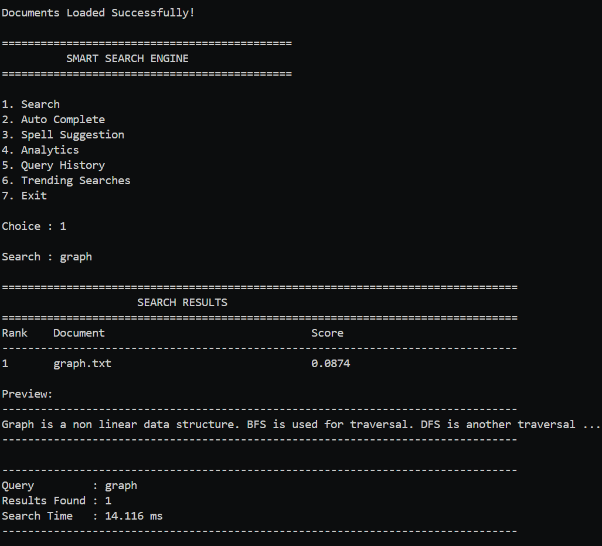
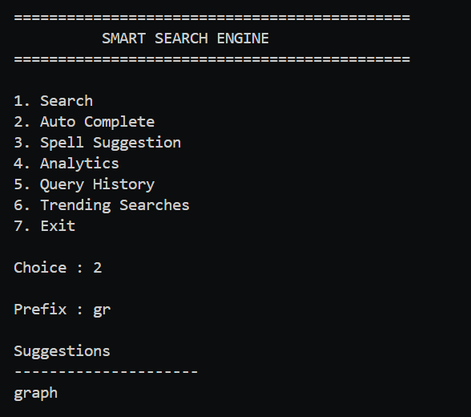
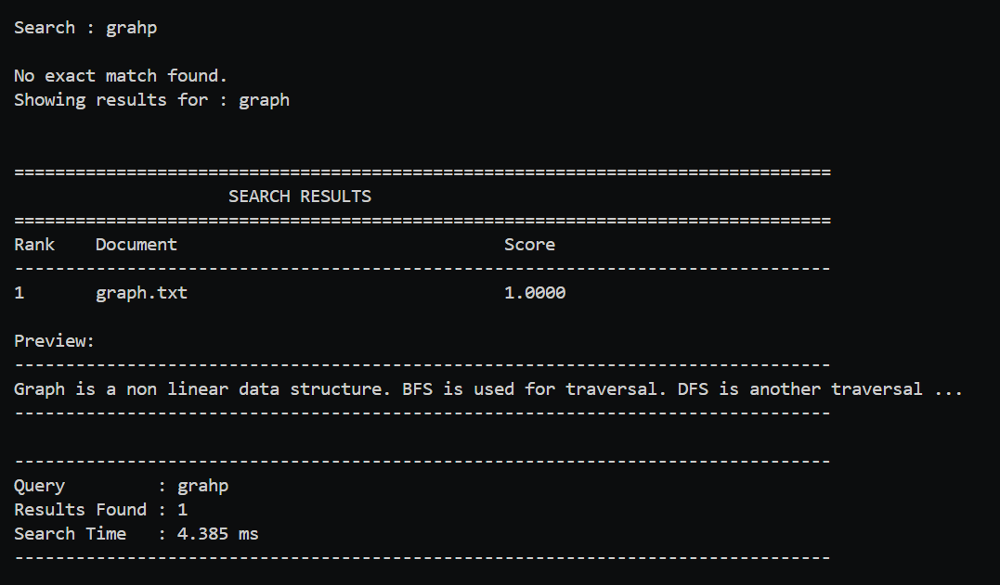
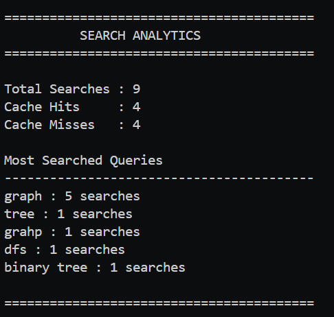
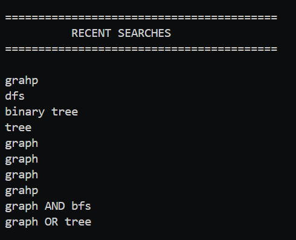
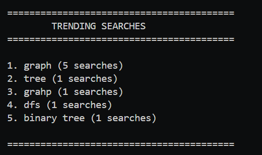
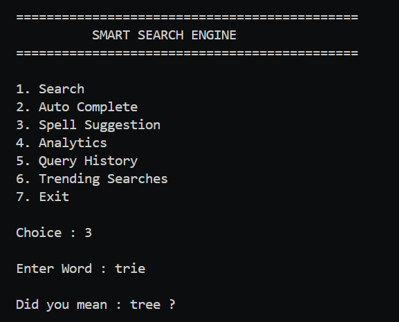

# 🔍 Smart Search Engine (C++)

A modular Smart Search Engine developed in Modern C++ implementing core Information Retrieval techniques including Inverted Index, TF-IDF Ranking, Trie-based Auto Complete, Boolean Search, Spell Correction, LRU Cache, Query Analytics and Fuzzy Search.

---

## ✨ Features

### 🔎 Keyword Search
- Fast keyword lookup using an Inverted Index.
- Ranked using TF-IDF scoring.

### 📈 TF-IDF Ranking
- Calculates document relevance using:
  - Term Frequency (TF)
  - Inverse Document Frequency (IDF)

### 🔤 Auto Complete
- Trie-based prefix search.
- Instant word suggestions.

### ✏️ Spell Correction
- Levenshtein Distance based spell suggestion.

Example:

```
Input:
grahp

Output:
Did you mean: graph ?
```

---

### 🤖 Automatic Fuzzy Search

If no exact match is found, the engine automatically searches using the closest suggested word.

Example

```
Input:
grahp

Output:
Showing results for:
graph
```

---

### 🔗 Boolean Search

Supports

- AND
- OR
- NOT

Example

```
graph AND bfs
graph OR tree
graph NOT dfs
```

---

### 📄 Phrase Search

Supports searching complete phrases.

Example

```
graph is
binary tree
```

---

### 📑 Snippet Preview

Displays a relevant preview from the matched document.

Example

```
Preview

Graph is a non linear data structure...
```

---

### ⚡ LRU Cache

Caches previous search results.

- Faster repeated searches
- Cache Hit / Miss analytics

---

### 📊 Analytics Dashboard

Tracks

- Total Searches
- Cache Hits
- Cache Misses
- Most Searched Queries

---

### 🕒 Query History

Stores the latest search history.

---

### 📈 Trending Searches

Displays the most frequently searched queries.

---

## 🏗️ Project Structure

```
```text
Smart-Search-Engine/
│
├── assets/
│   ├── search-results.png
│   ├── spellSuggestion.png
│   ├── fuzzy-search.png
│   ├── analytics.png
│   ├── history.png
│   |── trending.png
│   └── autoSuggestion.png
│    
├── data/
│   ├── Documents/
│   ├── stopwords.txt
│   ├── history.txt
│   └── index.txt
│
├── include/
│   ├── Analytics.h
│   ├── Document.h
│   ├── FileManager.h
│   ├── InvertedIndex.h
│   ├── LRUCache.h
│   ├── Parser.h
│   ├── Ranking.h
│   ├── SearchEngine.h
│   ├── SearchResult.h
│   ├── SpellCorrector.h
│   ├── Trie.h
│   └── Utils.h
│
├── src/
│   ├── Analytics.cpp
│   ├── Document.cpp
│   ├── FileManager.cpp
│   ├── InvertedIndex.cpp
│   ├── LRUCache.cpp
│   ├── Parser.cpp
│   ├── Ranking.cpp
│   ├── SearchEngine.cpp
│   ├── SpellCorrector.cpp
│   ├── Trie.cpp
│   ├── Utils.cpp
│   └── main.cpp
│
├── .gitignore
└── README.md
```


---

## 🧠 Algorithms Used

| Feature | Algorithm / Data Structure |
|----------|---------------------------|
| Keyword Search | Inverted Index |
| Ranking | TF-IDF |
| Auto Complete | Trie |
| Spell Correction | Levenshtein Distance |
| Fuzzy Search | Approximate String Matching |
| Boolean Search | Set Operations |
| Cache | LRU Cache |
| History | Vector |
| Trending | Hash Map + Sorting |

---


---

## ⏱️ Time Complexity

| Feature | Time Complexity |
|----------|-----------------|
| Keyword Search | O(1) average lookup (hash map) + TF-IDF ranking |
| Auto Complete | O(prefix length + suggestions) |
| Spell Correction | O(dictionary × word length²) |
| Boolean Search | O(n) |
| Phrase Search | O(number of documents × document length) |
| LRU Cache | O(1) |
| Query History | O(1) |
| Trending Searches | O(n log n) |

---


## 🚀 How to Build

```
g++ -std=c++20 src/*.cpp -I include -o SearchEngine
```

Run

```
./SearchEngine
```

---

## 📸 Sample Output

```
Search : graph

========================================
SEARCH RESULTS
========================================

Rank    Document            Score

1       graph.txt           0.0874

Preview

Graph is a non linear data structure...
```

---

## 📚 Concepts Demonstrated

- Object-Oriented Programming (OOP)
- Data Structures
- STL
- File Handling
- Information Retrieval
- Search Algorithms
- Ranking Algorithms
- Caching
- Hashing
- String Processing

---

## 🔮 Future Improvements

- Web Interface
- Positional Inverted Index
- BM25 Ranking
- Multi-threaded Indexing
- PDF/Text File Support

---


## 📸 Screenshots

### Keyword Search



---

### Auto Suggestion



---

### Automatic Fuzzy Search



---

### Analytics Dashboard



---

### Query History



---

### Trending Searches



---

### Spell Suggestion




## 👨‍💻 Author

Aditya Kumar

IIT Kharagpur

```

---
